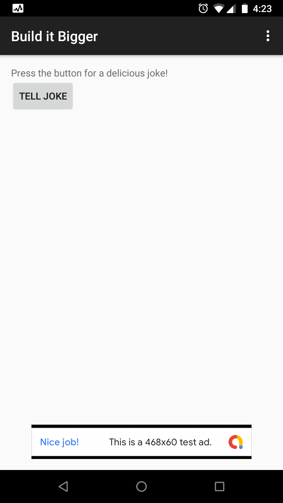

# Build It Bigger

## Description
A joke telling app, with free (ad-supported) and paid product flavours.

## Screenshot

## Summary
This app consists of four modules. 
* A Java library that provides jokes.
* A Google Cloud Endpoints (GCE) project that serves those jokes.
* An Android Library containing an activity for displaying jokes.
* An Android app that fetches jokes from the GCE module and passes them to the Android Library for display.
